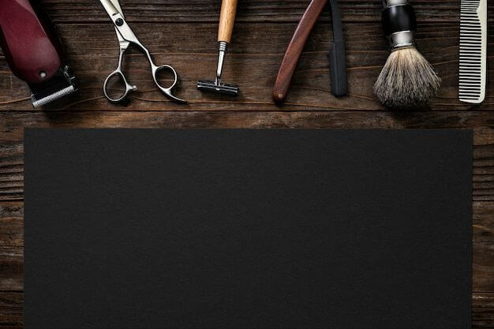

<div align="center">
    <h1>Dario's Barbershop</h1>
    
</div>

## What is it about?

A Barbershop website.

## Want to contribute?

- Create a fork on my repository.
- Clone the repository to your PC.
- Create a new branch and make the changes you want, adding documentation.
- Push the changes to your repository and send a Pull Request.

## Installation and Usage

### Requirements

- Node.js (version 14 or higher)
- npm (version 6 or higher)

### Installation

1. Clone the repository:

```sh
git clone https://github.com/Zero10903/dariosbarbershop.git
```

1. Navigate to the project directory:

```sh
cd dariosbarbershop
```

3. Install the dependencies:

```sh
npm install
```

### Usage

To start the development server, run:

```sh
npm run dev
```

## Demo

> [!IMPORTANT]
> Demo will be released when the project finishes.

## License

_MIT_

## Contact me

<a href="https://instagram.com/eternal__delirium"></a> | <a href="mailto:sam.alejandro.bustos@gmail.com"></a> | <a href="https://es.fiverr.com/sam_bustos"></a>
